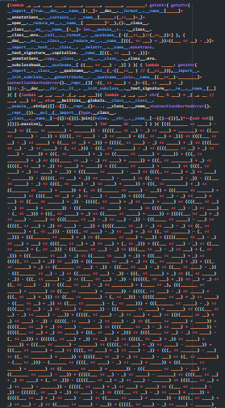
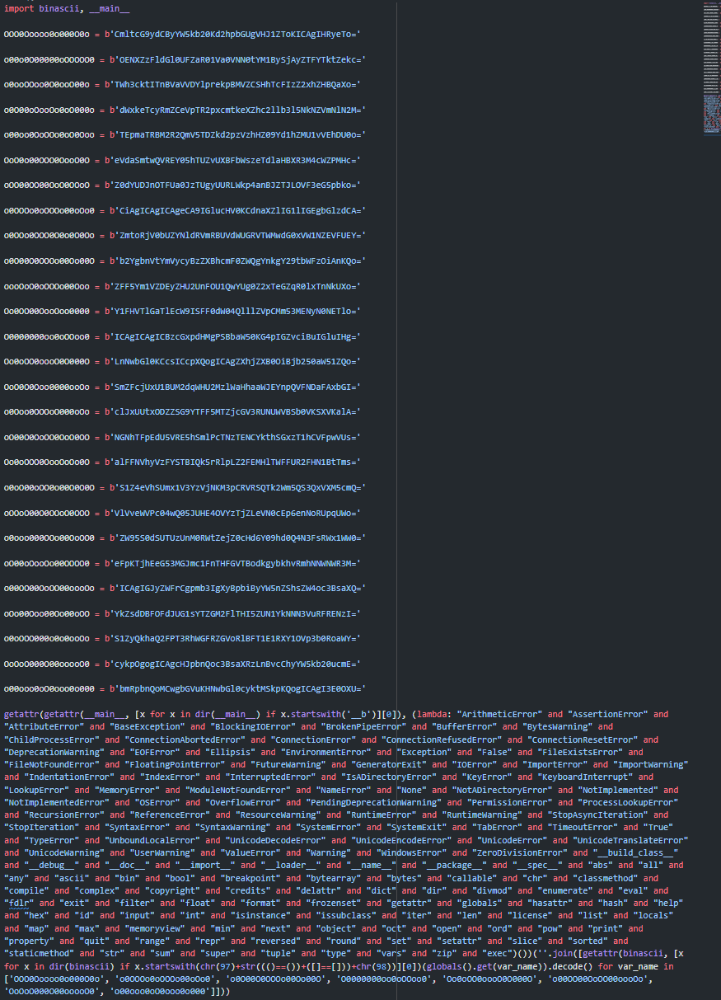

# python-obfuscator
This is a proof of concept and personal challenge of mine. 
This project shows off some clever techniques to do some interesting stuff.

"Learn the rules like a pro, so you can break them like an artist" - Pablo Picasso

Of course, these two methods of obfuscation are not fool-proof. It shouldn't
take an expert to crack these.

## Yikes
This function chops up your code and encodes it as numbers. The end result is
a horrific, unreadable mess with no numbers or strings within the code.

This was very much inspired by Ben Kurtovic's [Obfuscating "Hello world"](https://benkurtovic.com/2014/06/01/obfuscating-hello-world.html).

## Puzzle
Chops up and encodes the inputted code and arranges it into
a waterfall of variable assignments. There are dummy segments included as well.

